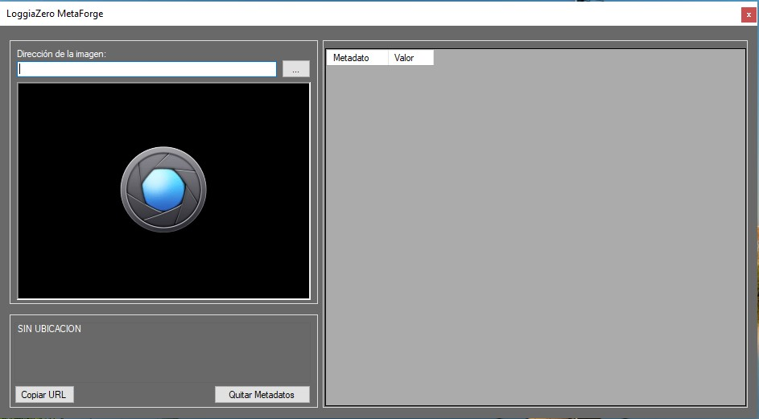
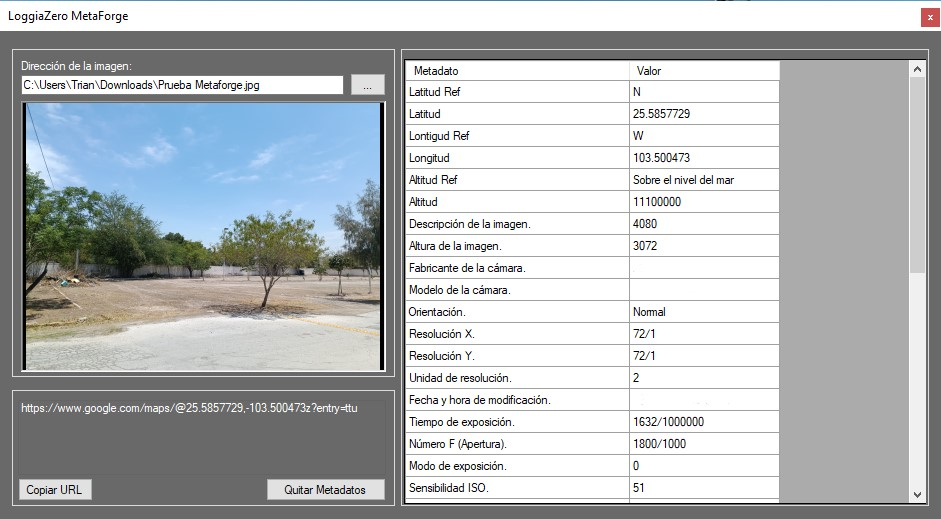
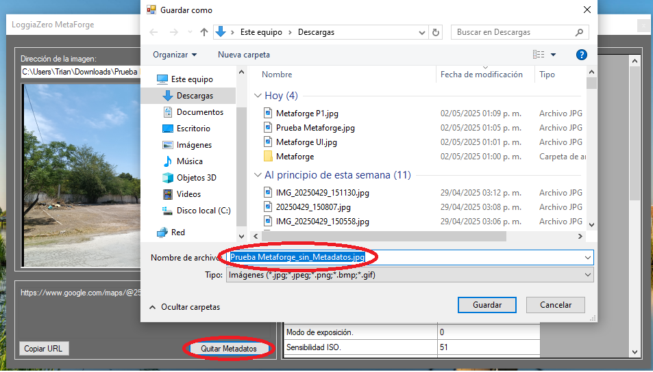
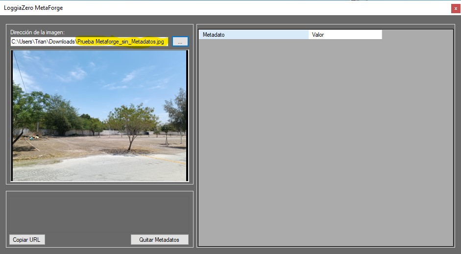

# 🧠 MetaForge

**MetaForge** es una aplicación de escritorio desarrollada en **C#** que te permite inspeccionar, limpiar y aprovechar los metadatos de tus imágenes locales de forma rápida y sencilla.

---

## 🚀 Características principales

🔍 **Visualización de metadatos**  
Carga una imagen desde tu equipo y obtén una lectura completa de todos sus metadatos disponibles (EXIF, GPS, fecha, cámara, etc.).

🧹 **Eliminación de metadatos**  
Protege tu privacidad borrando todos los metadatos sensibles de una imagen con un solo clic.

🌍 **Ubicación en Google Maps**  
Si la imagen contiene coordenadas geográficas en sus metadatos, MetaForge genera automáticamente un enlace directo a Google Maps para visualizar el lugar donde fue tomada.

📁 **Interfaz amigable**  
Diseño limpio y simple pensado para usuarios técnicos y no técnicos por igual.

---

## 📸 Capturas de pantalla

<details>
  <summary><strong>🖥️ Vista general de la interfaz</strong></summary>
  <br>
  <p align="center">
    <a href="assets/gui.jpg" target="_blank">
      
    </a>
  </p>
</details>

<details>
  <summary><strong>🧭 Paso a paso: Uso de MetaForge</strong></summary>
  <br>

  <div align="center">

  <!-- Paso 1 -->
  <a href="assets/paso1.jpg" target="_blank" style="margin: 10px;">
    
  </a>
  <div><strong>Paso 1</strong></div>
 <div align="center">Da click en los tres puntos y selecciona la imagen</div>
 </br>

  <!-- Paso 2 -->
  <a href="assets/paso2.jpg" target="_blank" style="margin: 10px;">
    
  </a>
  <div><strong>Paso 2</strong></div>
  <div align="center">El boton de "quitar metadatos" crea una copia de la imagen sin metadatos</div>
  </br>


  <!-- Paso 3 -->
  <a href="assets/paso3.jpg" target="_blank" style="margin: 10px;">
    
  </a>
  <div><strong>Paso 3</strong></div>
  <div align="center">Abre la imagen nueva y comprueba</div> 

  </div>

</details>

---
## 🛠️ Tecnologías utilizadas

- Lenguaje: **C# (.NET Framework)**
- Plataforma: **Windows**
- GUI: **Windows Forms**

---

## 🧰 Casos de uso

1. **Auditoría y análisis digital**  
   Útil para forenses, investigadores o fotógrafos que necesitan analizar información técnica o de ubicación de una imagen.

2. **Protección de privacidad antes de compartir**  
   Permite eliminar datos personales (ubicación, dispositivo, hora) antes de publicar fotos en redes sociales.

3. **Seguimiento de ubicación por coordenadas GPS**  
   Herramienta práctica para viajeros, periodistas o bloggers que desean rastrear o verificar la ubicación de sus imágenes.

---

## ⚙️ Cómo empezar

### 🔧 Opción 1: Ejecutar directamente

Descarga el archivo ejecutable desde la sección 👉 [Releases](../../releases).

No requiere instalación. Solo descarga y ejecuta.

---

### 💻 Opción 2: Clonar y compilar manualmente

1. Clona este repositorio:
   ```bash
   git clone https://github.com/tu_usuario/MetaForge.git
